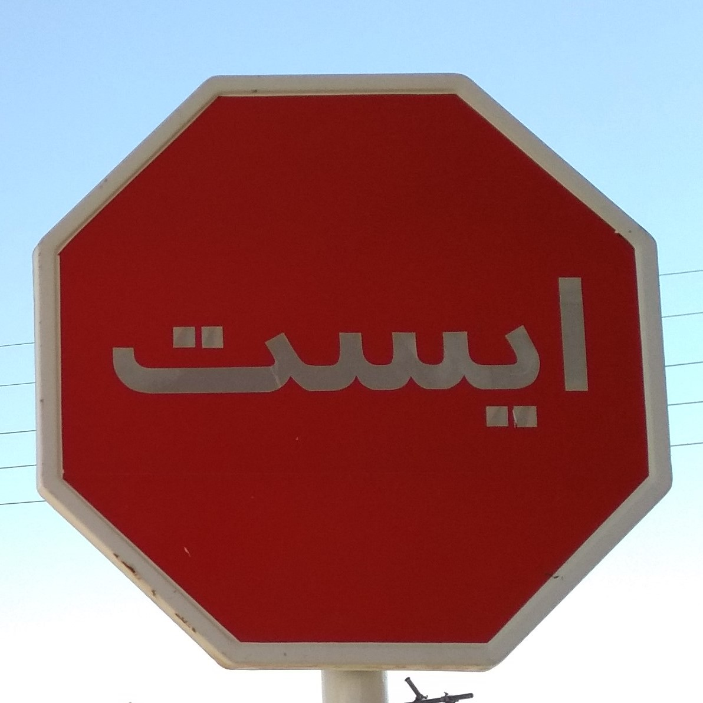

# **CarND Project 2 Writeup** 
# **Traffic Sign Recognition** 

### This writeup includes a description for each of the following goals/steps:
#### 1. Data Set Summary & Exploration,
#### 2. Design and Test a Model Architecture, and
#### 3. Test a Model on New Images

##### NB This repository does NOT contain either the data or the augmented data. Download/create these yourself and put them in the correct directory.

[//]: # (Image References)

[data_distr]: ./data_class_distribution.jpg "data class distribution"
[unnorm]: ./unnormalized.jpg "unnormalized traffic sign"
[norm]: ./normalized.jpg "normalized traffic sign"
[new_imgs]: ./Data/new_images.jpg "New traffic signs"
[Farsi_stop]: ./Data/Farsi_stop.jpg "Farsi stop sign"

---

### Data Set Summary & Exploration

#### 1. Summary

It is always important to have a summary of the dataset, to know what we are working with:

* Number of training examples = 34799
* Number of validation examples = 4410
* Number of testing examples = 12630
* Image data shape = (32, 32)
* Number of classes = 43

#### 2. Exploration

One good data set validity check one can perform is to compare the class distribution between the training, validation and test set.
Preferably, these all represent 'real world' samples, which mean the class distribution should be equal among all three sets. If one of the distributions is odd, it means one of the sets is off, and not properly representing the true sample distribution.

We should be careful not to look too much to the test set however, as any information it gives us might bias us in designing our model. Looking at the mere distribution however hopefully does not undermine the validity of a model yet only bolsters it:

![alt text][data_distr]

This bar chart shows the (normalized, cause the sets have very different sizes) quantity of each class as part of the total for said class.
Since the three different colors, or sets, have a very similar distribution, we can safely accept these sets as representing the same sample distribution. We then assume that this same sample distribution represents the true world sample distribution. 

---

### Design and Test a Model Architecture

#### 1. Data preprocessing and augmentation

Models often train better with normalized inputs, so the training, validation and test set are all normalized in a straightforward way: by calculating the training set mean image and standard deviation image, and then subtracting the mean from each sample and subsequently dividing each sample by the std. The mean and std image should be calculated only from the training set, as the validation and test set are supposed to remain unknown until testing upon them.

Normalizing the images to greyscale might have decreased the training time, but was initially not adopted, and not deemed necessary later on.

Consequently, the training set is augmented with perturbation functions from a small library written especially for the purpose of augmenting visual data sets, the Utils/Perturb_Functions.py file. This file includes typical perturbation functions such as translation, zooming, rotation, and gaussian noise addition, somewhat similar to [LeCun's model](http://yann.lecun.com/exdb/publis/pdf/sermanet-ijcnn-11.pdf) mentioned in the Ipython notebook. It furthermore includes some less common methods like Krizhevsky's [fancy PCA](https://papers.nips.cc/paper/4824-imagenet-classification-with-deep-convolutional-neural-networks.pdf) (color perturbation).

Due to limitations in hardware the training set is augmented 5 times (this could easily be much more with the right computational power and memory storage). Including the original samples, this increases the total training set size to 208794 samples. It seems that the original dataset already contains shifted images, so the factor 6 can be achieved by just using a zooming in/out perturbation and a rotation perturbation.

#### 2. Final model architecture

For the sake of modularity and readability, I have defined some stand-alone functions implementing typical layer architectures. This results in a clear overview in the cell that defines the entire model architecture by calling these functions:
    
    with tf.variable_scope('Conv1'): #Convolutional + max pool 32x32x3 -> 14x14x6
        x = conv2d_BN_ReLU_maxp(x, W, b, strides=1, BN_train=BN_tr, pool=2)

    with tf.variable_scope('Conv2'): #Convolutional + max pool 14x14x6 -> 5x5x16
        x = conv2d_BN_ReLU_maxp(x, W, b, strides=1, BN_train=BN_tr, pool=2)

    x   = flatten(x) # Flatten 5x5x16 -> 400
    
    with tf.variable_scope('FC3'): # Fully Connected + dropout 400 -> 120
        x = fc_BN_ReLU_drop(x, W, b, BN_train=BN_tr, keep_prob=dropout)
    
    with tf.variable_scope('FC4'): # Fully Connected 120 -> 84
        x = fc_BN_ReLU_drop(x, W, b, BN_train=BN_tr, keep_prob=dropout)
    
    with tf.variable_scope('FC5'): # Fully Connected 84 -> 43
        x = fc(x, W, b)
    
    logits = x

As can be seen, the model consists of 2 convolutional layers, following by 3 fully connected layers. The initialization of the weights and biases for each layer are left out in the snippet above.
Both convolutional layers use 5x5 kernels with stride 1, the first 6 and the second one 16. They both adopt MaxPooling, [Batch Normalization](https://arxiv.org/abs/1502.03167), and ReLU activation functions.
After the two convolutional layers, the output is flattened (to a size of 400 neurons) to form an input for two similar fully connected layers. These both use Batch Normalization and ReLU activation functions as well, on top of which they also implement [Dropout](https://arxiv.org/abs/1207.0580).
The first fully connected layer reduces the hidden size to 120, the second one to 84.
The final fully connected layer is the mapping to each of the classes, and does not contain anything else than a matrix multiplication and a bias addition.

This model is roughly based on the LeNet architecture treated in the online classroom. Instead of increasing the dimensions of the model (more kernels, more layers, bigger hidden layers etc.), I chose to first optimize the existing layers a bit with common, proven quality techniques like Batch Normalization and Dropout. Due to hardware limitations I didn't try out any different size configurations than the one described.

Summarized, the size of the hidden layers are as follows:

| Layer		| Output size (batch size omitted)	| 
|:---------:|:---------------------------------:| 
| Input		| 32x32x3 RGB image					| 
| 'Conv1'	| 14x14x6							|
| 'Conv2'	| 5x5x16							|
| flatten	| 400								|
| 'FC3'		| 120								|
| 'FC4'		| 84								|
| 'FC3'		| 43 classes						|

#### 3. Training specifications and hyperparameters:

The model is trained in Tensorflow with the Adam optimization algorithm and a cross entropy softmax loss. The hyperparameters were set to:

    EPOCHS     = 10
    BATCH_SIZE = 128
    DROPOUT    = 0.7    # KEEP PROBABILITY
    LRN_RATE   = 0.001
    N_CLASSES  = 43

#### 4. Training results

The final model results are:
* Training Accuracy = 0.988
* Validation Accuracy = 0.960
* Test Accuracy = 0.941

As mentioned above, due to limitations of my hardware, I haven't tried a lot of different sized architectures nor different options for the hyperparameters, so I assume it must not be too hard to squeeze an extra few percentage out of an optimized architecture. However, the current model seems to perform decently well already. Once I have the AWS set up I hope to try out more architectures and hyper parameter tuning (for the next ML project I assume).

Room for improvement includes the following options (not exhaustive):

For one, there is a small discrepancy between the training accuracy and the validation accuracy, indicating a slight overfitting. More regularization might diminish this gap, but as long as it exists it is not a good idea to increase the size of the model (to prevent further overfitting).

Secondly, in most training instances, the validation accuracy saturated at around the 5th epoch already. This means the training time can be cut in half, or a smaller/decaying learning rate can be adopted to improve final accuracy.

Another option to improve the model performance is to store the parameters belonging to the best validation accuracy epoch, instead of simply training for the full number of epochs and saving the parameters belonging to the last iteration. (A better option even would be to include an ensemble).

---

### Test a Model on New Images

#### 1. 5(/6) new traffic sign images:

From the web I was able to find 5 german traffic sign images.

For fun, I have included the following farsi stop sign image from my holiday in Iran as well, curious to see how well our model generalizes for similar yet different signs.

Except for the new stop sign as a sort of bench mark for the farsi stop sign, I've deliberately chosen rather hard and tricky samples, to properly test the robustness of the model. I found these images online, which actually means that there is no guarantee they are indeed new and not already included in the dataset, but let's assume they're not.

#### 2. Predictions on these new traffic signs

These are the actual signs classes as well as the predictions:

| Image			        |     Prediction	        					|
|:---------------------:|:---------------------------------------------:|
| Stop					| Stop sign   									|
| Speed limit (20km/h)	| End of speed limit (80km/h)					|
| No entry				| No entry										|
| Beware of ice/snow	| Speed limit (30km/h)			 				|
| No passing			| Yield											|
| | |
| Stop(?)				| Stop											|

As can be seen from above, not counting the farsi image,
only the first and third new images are classified correctly, resulting in a 40% accuracy.
This is fairly low (much lower than either the training, validation or test accuracy), but obviously due to the difficulty of the images.
For example, considering the fifth image, the circle is cut off above with a red line. Hence, it is not hard to imagine the model interpreting  the resulting shape as an upside-down triangle: the traffic sign Yield.

Interestingly enough, the stop sign in farsi language is classified correctly. One plausible explanation for this is that perhaps the shape of a stop sign is more important than what is written on it. Another explanation could be that the model can detect languages, but not actually 'read' them. Thus, it wouldn't make a difference for the model whether some written word on a sign is in english or in farsi.

#### 3. Top 5 softmax probabilities for each new image

The following table lists the top 5 softmax probability and predicted label for each of the 5 new images:

| First image (Stop)|| Second image (Speed limit (20km/h)) || Third image (No entry) || Fourth image (Beware of ice/snow) || Fifth image (No passing) ||
|:------:|:---------:|:--------------:|:-----------:|:---------------:|:-----------:|:------------:|:-----------:|:--------:|:-----------:|
| Prediction | Probability | Prediction | Probability | Prediction | Probability | Prediction | Probability | Prediction | Probability |
| Stop					| 100.00%	  | End of speed limit (80km/h)	| 64.69%	  | No entry			  | 100.00%		  | Speed limit (30km/h)								 | 98.74%	| Yield											| 99.99%	|
| Priority road			|   0.00%	  | End of no passing			| 16.87%	  | Speed limit (20km/h)  |  0.00%		  | End of no passing by vehicles over 3.5 metric tons |  0.76%	| No passing for vehicles over 3.5 metric tons	|  0.01%	|
| Speed limit (50km/h)	|   0.00%	  | Keep right					| 9.77%		  | Speed limit (30km/h)  |  0.00%		  | End of speed limit (80km/h)						 |  0.49%	| Priority road									|  0.00%	|
| No entry				|   0.00%	  | Roundabout mandatory		| 3.74%		  | Yield				  |  0.00%		  | Roundabout mandatory								 |  0.01%	| No passing 									|  0.00%	|
| Speed limit (60km/h)	|   0.00%	  | Speed limit (20km/h)		| 1.13%		  | Stop				  |  0.00%		  | End of no passing									 |  0.00%	| Ahead only									|  0.00%	|

As can be seen in this table, the model is extremely sure (a rounded 100%) in both the first image case and third image case. Since the model classified both of these images correctly, this is very good news.
However, the model is also extremely sure in the fourth and fifth image cases, where it wrongly classifies with a probability of 98.74% and 99.99%. It is good to see that these numbers are not a 100% like the correctly classified images, but still a 99.99% probability for a wrong class is quite bad.
In the second image the probabilities are much lower, but the correct class still only gets a meagre 1.13% on a fifth place.

This overconfidence of the model can likely be mitigated by more regularization (higher dropout rate, adding L2 regularization, etc.).
Since these chosen new images are pretty tricky, it could also help to find a lot more of these tricky images and include those in the training set.

